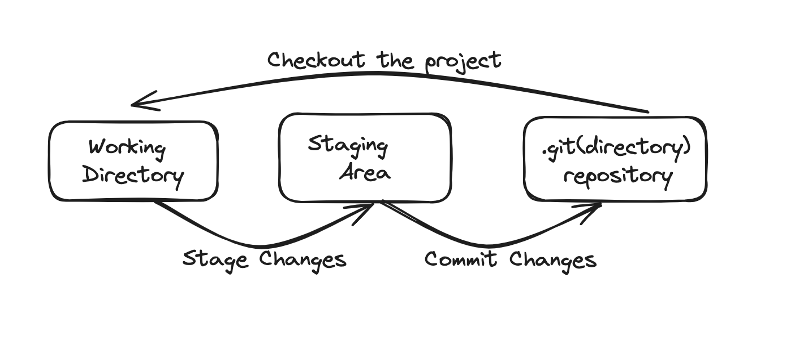
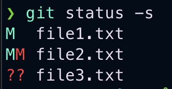
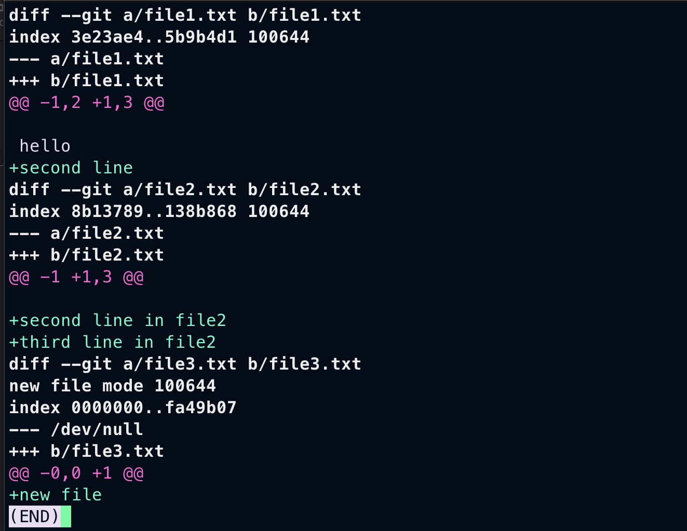
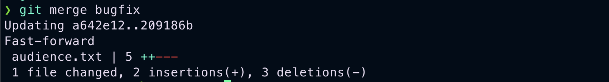
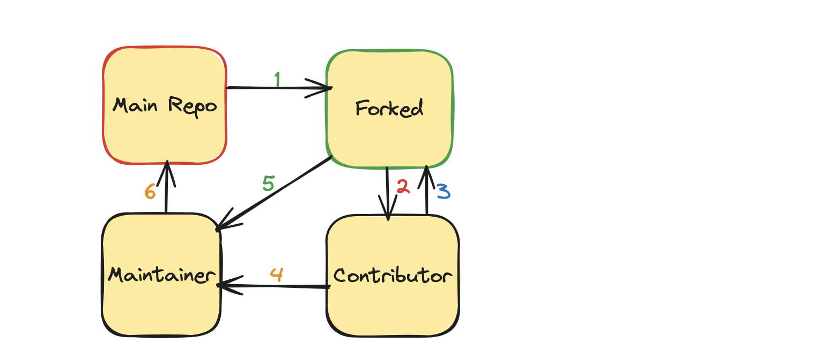
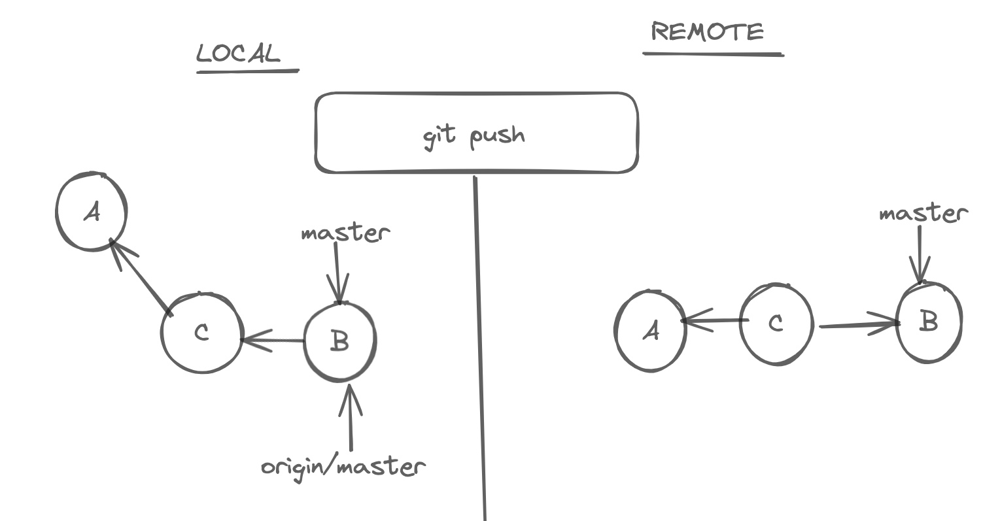

# MasteringGit

## What are version control systems?

Version control systems record changes made to our code in a special database called repository. We can see the project history, who made the changes, and when and why. If something terrible happens, we can quickly return to our previous state. Without a version control system, we have to constantly store copies of projects, which is not at all scalable, and contribution also becomes too difficult. Version Control systems fall into two categories.

### CVCS

In Centralised Version Control Systems(CVCSs), all team members connect to a central repository to get changes. Subversion and Microsoft Team Foundation Server are examples of these. The disadvantage of CVCS is its single point of failure. If the server goes offline, we cannot create snapshots or get new changes until the server comes back online. For many years, this has been the standard for version control.

### DVCS

This is where Distributed Version Control Systems (DVCSs) step in.
In Distributed Version Control Systems(DVCS), everyone has a copy of the repository with history on their machine locally. So we can save snapshots of our work locally and synchronize them with others afterwards. Git and Mercurial are examples of these. This allows you to set up several types of workflows that aren’t possible in centralized systems, such as hierarchical models.

## What is git?

Out of all these version control systems, Git is the most popular one. Because it is free, open-source, fast and scalable, Git stores and thinks about information differently, and understanding these differences will help you avoid becoming confused while using it. It stores snapshots, not differences. I will say this a couple more times, so remember this. Git doesn't store differences. It stores snapshots. This is a fundamental concept to understand. When you commit, Git keeps a snapshot of what all your files look like at that moment and stores a reference to that snapshot. If the file hasn't changed, Git doesn't keep it again; it is just a link to the previous identical file stored. This is why Git is so fast and efficient. It doesn't store duplicate content. Git is also very good at branching and merging. It is straightforward to create branches and merge them; only a bit of common sense is required. This is why Git is very popular among developers.

We can use the git cli which is fast and easiest for most of the time. But almost all editors support basic git features. There are also graphical user interfaces specifically made to use git. But these GUI tools have some limitations. GitKraken is one of the most popular ones.

## What is GitHub?

GitHub is a popular git hosting platform in the world. Which makes collaboration far more easy. A large percentage of git repositories are hosted on GitHub, and many open-source projects use it for Git hosting, issue tracking, code review, and other things. It is also the largest source code host in the world, with over 100 million repositories. GitHub is the most popular platform for open-source projects. It has a lot of features that make it easy to work with other people. You can also use GitHub to host your own projects, and it is a great way to show off your coding skills to the world. It is also a great way to contribute to open-source projects.

## Installing Git

### Installing on Windows

Go to the [official website](https://git-scm.com/) and download the latest version of git. After downloading, run the installer and follow the instructions. You can verify the installation by running the following command.

```bash
git --version
```

### Installing on Mac

There are two ways to install git on mac. One is to download the latest version from the official website. The second one is to use the homebrew package manager. Homebrew is the most popular package manager for mac. If you don't have it, you can install it by running the following command.

```bash
/bin/bash -c "$(curl -fsSL https://raw.githubusercontent.com/Homebrew/install/HEAD/install.sh)"
```

After installing homebrew, you can install git by running the following command.

```bash
brew install git
```

After installing, you can verify the installation by running the following command.

```bash
git --version
```

# Basics

## Configuring git

The first time we use git we have to specify a few configuration settings.

To configure name

```bash
git config --global user.name "vlm lokesh"
```

To configure email ( In email there is no space so double quotes are optional )

```bash
git config --global user.email nothuman2.718@gmail.com
```

To configure the editor ( If We don't set this by default in mac it takes vim in other OS it takes system default editor ). This command is for vscode. Meaning of the --wait flag is thread waits until we close the editor.

```bash
git config --global core.editor "code --wait"
```

Use this to open global config file

```bash
git config --global -e
```

To configure line ending ( In windows end of the line is marked with two special characters \r => carriage return and \n => line feed. But in mac and linux the end of line is \n => line feed only ). So when we are working with a team, we should configure this properly.

For windows (automatically changes line feed when pulling and pushing)

```bash
git config --global core.autocrlf true
```

For Linux (You should only change the line feed when storing data in a repository, like input to the repository. If your file has CRLF, it should be converted to LF. Sometimes, it may happen when you get a file from a Windows user. The Unix systems will not throw any error even if you have CRLF in your file. They can handle both. But when you push the file to the repository, it should be converted to LF)

```bash
git config --global core.autocrlf input
```

# Git Workflow

## Creating Snapshots

## Creating A Repository

Before starting a project. When you create a folder it's better to initialize git at that moment itself.

```bash
git init
```

After you will see a message that an empty git repository is initialized. If you want to check whether git is initialized you can do this command ( To see hidden files, by default .git directory is hidden, we are not supposed to modify it )

```bash
ls -a
```

You can see .git directory you can open that by using.

```bash
open .git
```

If you are using git, that doesn't mean you should understand all those details. Those are just implementation details. But understanding these helps you get a strong foundation. If we remove this directory, you will lose your project history.

Very Very dangerous command. Do only when you know what you are doing.

```bash
rm -rf .git
```



- We modify one or more files as we work on different tasks. We commit the changes when our project reaches a state we want to record.
- Commit is like taking a snapshot of the current scenario.
- Git, unlike other VCS, introduces a crucial element in our workflow- the staging area or index. This intermediary space is where we add our modified changes for review before committing them. It's a vital part of ensuring we commit to the right changes.
- The staging area is our tool for recording work before committing. It allows us to commit changes in stages. For instance, if we want to commit some changes separately after reviewing the staging area, we can easily un-stage them and commit the changes excluding this. This approach promotes a more organized and manageable development process.
- Remember one thing: We should always properly follow the separation of concerns and commit the message according to each concern.
- A fundamental principle in git usage is to maintain a useful history. We make commits as we fix bugs, implement new features, and refactor code. Each commit should serve as a clear and concise explanation of the project's state. This practice helps us track changes and aids in collaboration and troubleshooting.
- Many people think that once we commit, the staging area becomes empty. But that's not true. This is why most people feel git is confusing.
- Even though we are deleting some files in the working directory that were staged before, we still use git add. To un-stage a file that has been deleted in the active directory.
- Each commit contains the unique identifier generated by git, a commit message, by whom and when, and a complete snapshot of the project when it was created. Each commit stores the complete data at that particular time, unlike other VCS.
- Git is very efficient in storing data. It compresses files and doesn't store any duplicate content. Remember this again: "SNAPSHOTS NOT, DIFFERENCES".


## Staging

You can run this command to get status of working directory and staging area. Index is the old term for staging area.

```bash
git status
```

You can use the -s flag to get a short status.

```bash
git status -s
```

You can see this example



Here is how it works. The leftmost column represents the index or staging area and beside column represents the working directory. From the image you can see that

- file1.txt is modified and also staged(M\_)
- file2.txt modified and staged after again modified in working directory(MM)
- file3.txt is untracked in both the staging area and working directory(??)

You can see untracked files in red colour. You may have many files in your project, but git will not track them unless you specify. Using this command, you can track them.

```bash
git add file1.txt file2.txt
```

If you want to add all files in one go. Use this command it will add recursively. You can use patterns to add files.

```bash
git add .
```

You can run the status command after adding them; you can see that all those files are now tracked and changed to green colour. If you modified some files in the working directory that were already staged, you should again add them to the staging area to make changes.

## Committing

If you use the -m flag, you can give a short message of what that commit is about without opening an editor. Sometimes, if the short message isn't enough, then you can do **git commit**, and then the default editor gets, asking you to enter a commit message. Most of the time, we use the -m flag.

```bash
git commit -m "Generic message"
```

After committing your changes you can see basic statistics of what has been committed.

## Best Practice while committing

Your commits should be a manageable size. We don't want to make a commit every time we change a file; that's just useless. The whole point of committing is to keep checkpoints as we go. So if we screw up, we can always go back and recover the code. As you feel like you have reached a state, you want to record the change and then make a commit. Each commit should also represent a logically different chain set. So, keep things from mixing up. In terms of wording, most people prefer to use the present tense. It is not a must-follow rule. But whatever you use, use consistently along with your team members.

We can skip the staging area and directly commit. But do only when you are confident about what you are doing. If you are not sure, don't do it because that's why the staging area is there. The key takeaway is that you can't track newly added files. To follow them, you need first to stage them.

```bash
git commit -am "Do only when you know what you are doing"
```

To know what files are there in the staging area. Use this command

```bash
git ls-files
```

To remove a file. We have to remove it from both the working directory and staging area. Git gives a command that does both operations in one go.

```bash
git rm file1.txt
```

To rename files in unix we use **mv** command. There is so much in this command, usually when we want to rename we use this

```bash
mv file1.txt newname
```

But when you use the above command in a project tracked by git, git takes this command differently: deletion of file1.txt, which is **an unstaged change** and an addition of an **untracked file** newname. So, when you try to change the name of a folder, the entire content gets deleted, and a new folder with the same content gets added. This is very bad practice. I have recently made this type of change, which changed the quality of my contributions.


So when you want to rename a file which is completely tracked by git. Use this command provided by git

```bash
git mv newname file1.txt
```

## Unstaging files

We should always review the stuff that you have in the staging area before making commit. After reviewing, if we find that some changes should not be part of this commit, we need to upstage those changes. So, we need to undo the add operation.

```bash
# We can also use reset command.
git restore --staged file1.txt
```

You need to understand how the restore command works. The restore command takes the copy from the following environment. So, for the staging environment, what is the following environment? It is the last commit we have in the repository. So, git takes the copy of this snapshot from the previous commit and modifies this staging area. Newly added files become untracked files.

### Discarding Local Changes

We can discard the local changes using restore command

```bash
# When we execute this command. Git copies the content from the next environment. What is the next environment here? It's the staging area.
git restore file1.txt


# Undo all changes. Remember this command is dangerous. It will remove all the changes in the working directory. So, use this command only when you are sure.
git restore .
```

You can observe a thing like that. Git cannot remove untracked files using the restore command. For that you need to use

```bash
#Remove all untracked files. Git gives a warning. Because this is a dangerous operation. So we need to use -fd to force remove all untracked files in whole directory
git clean -fd
```

## gitignore

In almost every project, we should say git to ignore specific files and directories. We don't want to include log files, binary files, executable files, node_modules, etc. Adding these files will increase the repository size without providing any values. So, to prevent this, we have to create a file called .gitignore. We can include as many files and directories as we want; this only works if you haven't included a file or directory in your repository. In other words, if you accidentally added a folder into the repository and later formed the folder in gitignore, that doesn't work. So if that happens, remove the file from the staging area, include it in .gitignore, and commit. From this point on, git will not track that folder.

```bash

# Ignore all .k extension files
\*.k

# But do track all lib.k, even though you are ignoring all .k files above
!lib.k

# Only ignore TOP file in the current directory, not subdir/TOP
/TOP

# Ignore all .DS_Store in any directory
.DS_Store/

# Ignore all doc/.txt files but not doc/subdir/.txt files

doc/*.txt

# Ignore all doc/.txt files even if they are in the subdirectories of doc directory.
doc/**/*.txt

```

For small projects generally we have a single .gitignore file. But as the project scales up there will be multiple .gitignore files in subdirectories. The rules in this nested .gitignore applies to its subdirectories.

If you have any queries on how to use .gitignore. Click this [link](https://github.com/github/gitignore). You can also search for git templates for almost all programming languages. There are almost 200+ gitignore templates for many types of projects.

## View Local Changes

Before committing changes, we need to review our code. Because we want to avoid committing bad code to our repository, as a best practice, always review your code in the staging area before committing. The git status command only shows the files that have been affected. To see what exactly is changed, we use the git diff command.

To see what exactly changed compared to the previous commit.

```bash
git diff --staged
```



From above image. Here is the breakdown

#### In file1.txt

a/file1.txt represents older file from last commit
b/file1.txt is the current file in the staging area.
Changes in the older file are shown as --a/file1.txt and changes in staged file are shown as ++b/file1.txt.
@@ -1,2 +1,3 @@ Represents total line in older file(-1) is 2 and total lines in newer file(+1) is 3. And down you can see the total content of the file after changes.

#### In file3.txt

You can see --- /dev/null this says that file3.txt is not there in the older commit.

If we want to see the changes between working directory and staging area we can use diff command without any flags(unstaged changes)

```bash
git diff
```

Above command will not show untracked files while showing diff between staging area and working directory.

Quite frankly. We cannot use the terminal to use the diff command. We need to use visual tools for better experience.

# Viewing a commit

Use this command to get the history. Sorted from the latest to top.

```bash
#For seeing total and detailed log
git log
```

Each commit has a unique identifier, which is a 40-character unique hexadecimal string. Next to that, we can see branches. For each commit, we can see the author's email, the Date and time when the commit was created and a one-line commit message.

```bash
#For seeing a short summary of the commits.
git log --oneline

#In reverse order. Sorted from oldest to newest
git log --oneline --reverse
```

For viewing what exactly is changed in commit we use show command

```bash
#unique identifier for some commit is 3b0003b
git show 3b0003b


#we can also type unique identifier partially as long as we don't have other commits starting with that
git show 3b00


#We can also use the ref HEAD pointer and specify how many steps we wanna go back. Shows one commit before HEAD.
git show HEAD~1
```

All above commands show the changes in multiple files. But if we want to see a particular file in a particular commit we can use above commands and mention the path

```bash
# To see contents of .gitignore. Let path .gitignore is subdir/.gitignore
git show 3b0003b~2:subdir/.gitignore
```

# Browsing History

After creating several commits, or if you have cloned a repository with an existing commit history, you'll probably want to look back to see what has happened. The most basic and powerful tool for doing this is the git log command.
Most of the time, you use this when doing projects sparingly. But this is a must skill if you want to contribute to open source or maintain a project. Overall, knowing this in-depth is a better idea.

## Viewing History

We can use the log command to get the history. By default all commits are sorted from newest to oldest.

```bash
#Get all commits in detail
git log


#Gives the summary of all these commits
git log --oneline
```

If we want to see the actual changes in each commit use --patch flag

```bash
git log --oneline --patch
```

## Filtering History

In real-world projects, we often have thousands of commits depending on the age of the repository. We only want to see some of the commits. So, filtering the commits is important. We can filter by author, by date, by commit message, and by content.

If we want to see the last 10 commits. Use this command

```bash
#Shows the last 10 commits
git log --oneline -10
```

Filter by author.

```bash
git log --oneline --author=nothuman2718
```

Filter by time. We can use before and after, We can also specify relative units like yesterday.

```bash
#Shows all commits after Feb 20
git log --oneline --after="2024-02-20"
```

Filter by commit messages.

```bash
#note this command is case sensitive
git log --oneline --grep="Word"
```

Filter by content.

```bash
#gives all the commits that added or deleted "keyword" this is also case sensitive
git log --oneline -S"key word"
```

Filter by range

```bash
#Gives all commits from hash1+1 commit to hash2
git log --oneline hash1..hash2
```

All the commits that touch a particular file. Simply add the filename at the end

```bash
#Shows all the commits that have touched file1.txt, the filename should be last argument
git log --oneline file1.txt

#Same command as above, but if you specified multiple flags, then you should separate the filename
git log -- file1.txt
```

Beauty of these commands is, you can use them together and that makes the filtering easy.

```bash
#Lists all the commits actual changes, committed by nothuman2718 after Jan 1st 2024, having Authentication keyword in the commit message, and have modified or deleted Filter word in the content.
git log --author=nothuman2718 --after=2024-01-01 --grep="Authentication" -S"Filter word" --patch
```

## Find the contributors

Sometimes we need to find all the people who have contributed to the project.

```bash
#Returns the all contributors, how many contributions they have made and there commit messages
git shortlog

#Returns all the authors sorted based on their no.of commit messages, and their email in summary
git shortlog -n -e -s
```

## Restore deleted file

```bash
#First find the file.
git log --oneline -- deleted.txt
```

Now after getting a log. Go to its parent and only restore this file in working directory

```bash
#Just add this file to the working area. We are not in a detached HEAD state. You will see what that is in future.
git checkout parenthash deleted.txt

#After commit this changes, so that file is restored
```

In the real world, each file will be changed by different contributors, So for knowing the author of each line we use the blame tool.

```bash
# shows every line and the author.
git blame file1.txt

#If there is a large file, then we should specify the range of lines
git blame -L 1 ,3 file1.txt
```

## Aliases

Git doesn’t automatically infer your command if you type it in partially. If you don’t want to type the entire text of each Git command, you can easily set up an alias for each command using Git config. Here are a couple of examples you may want to set up:
In git, we can easily set aliases for frequently used commands. So we can skip typing in long form. Aliases increase our speed.

```bash
#changing git add to ga
git config --global alias.ga "git add"


#changing git log --oneline to glo
git config --global alias.glo "git log --oneline"
```

## Moving to another Commit

We can move to an old commit. And this will restore our working directory to the snapshot stored in that commit. So our working directory will look exactly like that commit.

```bash
# let the commit hash we wanna check in is 56rce
git checkout 56rce
```

Now you can see a warning saying that. You are in a detached head state. Here is what it is; see how git keeps track of commits. Each commit we created references the previous commit. See below, how git can maintain history.


In git and other version control systems, there is a concept called branching. We can have multiple branches to work on different features in isolation. Every git repository has a default branch called Master, the main line of work. The way git represents branches is by using a pointer. So, as we create new commits, the Master moves to the latest commits. Because we can have multiple branches, git needs to know what branch we are currently working on. For that, it uses another unique pointer called HEAD. So, HEAD points to the current branch we are working on. In this case, Master


You must have seen this before. When we do log there, it specifies (HEAD -> Master). As we create new commits, these two pointers move forward.
Here is the thing: when we check out a particular commit, HEAD moves to that specific commit. This is what we call a detached head state.


At this point, we should not create new commits because if we make a new one, those commits will be added over HEAD. At some point, we have to add the HEAD pointer again to the master branch. This commit we just created is not reachable, like a dead commit. Git checks for these types of commits periodically and removes them. Then we will lose all our work. We should only look around and make experimental changes.


You can see in the above image, no node is pointing to a new node when we are traversing from the Master branch, once the HEAD moves to its position.

When we are in a detached HEAD state. We don't see all other commits when we logged history.

```bash
#Lists the commits from First Commit to current HEAD Commit.
git log --oneline


#To List all the commits, we should use this command
git log --oneline --all
```

Atlast, To attach HEAD pointer to master

```bash
git checkout master
```

# Branching

A branch in Git is a straightforward concept. It's a lightweight, movable pointer to one of the commits. The default branch name in Git is master. As you make commits, you're given a master branch pointing to your last commit. Every time you commit, the master branch pointer moves forward automatically, making it easy to track your progress.
Branching in Git is a powerful tool that allows us to diverge from the main line of work and work in isolation. This means you can experiment, test, and develop new features without fearing disrupting the main project. It's like having your sandbox, giving you the freedom and control to work on your tasks without affecting others.

- It is typically created when our code is unstable when we successfully fix all bugs and merge into the master branch. This is called merging. So, branching allows us to work on different items without messing up with the main line of work.
- We keep the main line as stable as possible. So we can release it at any time.
  The way Git manages branches is unique and efficient compared to other VCSs. For instance, in subversion, when we create a new branch, the total content of the main branch is copied to it, which can be time-consuming and space-wasting. But in Git, branches are just pointers to the commit, making it a more streamlined and resource-friendly process.
- When we create a new branch, Git creates a new pointer that can be moved around.
- This pointer is just a tiny file that contains a 40-byte commit ID; when we create new commits, Git moves this pointer accordingly. The master pointer stays where it is. So Git knows the latest code for each branch. So when we switch to master, Git takes the snapshot that master points to and resets that with the working directory.

But how does Git know What branch we are working on? Using a unique pointer called HEAD. It is also just another tiny file. That contains the name of the branch. When we move to different branches, Git moves this pointer around. It updates the small file and changes the name of the branch.

## Branch Management

To create a new branch

```bash
git branch bugfix
```

To see the list of branches

```bash
#When you use this command, you get all branches, and you can see asterisks(*) before the current branch you are in
git branch


#You also see what branch you are in by status
git status
```

To switch into a new branch

```bash
#Modern command
git switch bugfix


#Older command
git checkout bugfix
```

To change the name of the branch

```bash
#Do not rename branches that are still in use by other collaborators.
#In real world, we are having hundreds of bugfixes, So it better to keep a generic name
git branch -m bugfix bugfix/signup-form
```

After working on the bugfix branch. When you see the log of commits, you can see that HEAD is now pointing to a new branch.


After switching to the master branch and see the log of commits.


You can see that the commit we made in another branch is not logged here, and HEAD is pointing to a newer commit in an older branch. This is the beauty of branching; it allows us to work on something in isolation. Also, git resets the current snapshot of this branch's commit with the working directory. We must give the --all flag if you want to see all other commits over the repository.

```bash
git log --oneline --all
```


Once we merge the bugfix branch into master branch, we need to delete it. By default git prevents us from deleting a branch, if it is not merged. And also you cannot delete the branch you are currently in.

```bash
#To delete the branch that is merged
git branch -d bugfix

#To delete a branch that is not merged
#If you are sure then, use force -D
git branch -D bugfix
```

There are few different ways to compare branches.

```bash
#Log all commits, that are in bugfix not in master
git log master..bugfix

#If you want to see actual changes
git diff master..bugfix

#If you are currently on master, you can use
git diff bugfix

#If you want to see what files have been changed
git diff --name-only bugfix
```

## Merging

Merging is all about bringing changes from one branch to another. In git, we have two types of merges.

- Fast Forward Merges
- Three Way Merges
  You can understand these from the following examples.

## Fast Forward Merge

If two branches have not diverged and there is a direct linear path from the target branch to source branch, Git runs a fast-forward merge; it simply moves the pointer from source to target branch. After we can simply remove the bugfix branch


## Three Way Merge

In the previous example, there is a direct linear path. But What if the main branch master also gets committed? Now, the branches have diverged. We have some changes in the master that don't exist in the bugfix branch. If you run a merge, git cannot move the master pointer directly forward and have it point to the same commit as the bugfix branch. Otherwise, we will lose the latest commit in the master. So, when we run a merge, git creates a new commit that combines the changes between these two branches. This is called a three-way merge because this new commit is based on three different commits of 1, 2, and 3 in the diagram below.

1 - The common ancestors of the both branches, which includes the before code.

2, 3 - And the tips of our branches, which contain after code.

4 - Is a merge Commit


## Fast Forward Merge

```bash
#To get changes of bugfix to master, we should be on master branch
git merge bugfix
```

As you can see below, the bugfix branch is one commit ahead of master and also there is a direct linear path. So when we run a merge, git will fast forward master.


After fast forward merge, it shows statistics of what has been changed.



After we log commit. We can see both branches pointing to same commit.


```bash
#Every time you create a branch, you have to switch to that branch which is two steps. You can run this single step
git switch -C newbugfix
```

And also, before introducing branching all our history is linear, but after it may be nonlinear, So you should use --graph flag too

```bash
git log --oneline --all --graph
```

Suppose we want to avoid doing a fast-forward merge. Here is how you can do it.
As you can see below, the newbugfix branch is one commit ahead of the master. There is a linear and direct path, But we are not interested.


Switch to master. And run this flag --no-ff, Editor opens asking you a message for merge commit.

```bash
git merge --no-ff newbugfix
```

After running the log command with --graph flag. Here is how it is


We can merge commits in both ways. It comes down to your preference. But --no-ff merges are a true reflection of our history. But they pollute history. But --no-ff allows reverting a commit quickly.

Fast forward, merge is default. But you can configure that.

```bash
#To remove fast forward as default in globally in all repositories
git config --global ff no
```

## Three way merge

See below example. Where only three way merge is possible.


```bash
git log --oneline --all --graph
```

You can see that after running this command. We get this, you can see there is no direct linear path from master to feature branch.


So when we try to merge, git is going to run a three way merge. It's gonna look at tips of the branches, Then it is gonna compare it with their common ancestor. Based on the differences it's gonna figure out how to merge or combine the changes into a new merge commit.

```bash
#from master branch
git merge feature
```

Here is how it looks after a 3 way merge.


To know the list of branches, that merged to master branch

```bash
#lists all branches that are merged to current branch
git branch --merged


#lists all branches that are not merged to current branch
git branch --no-merged
```

After that, it is safe to delete all these branches. As a best practice, you should delete it whenever you are done working on a branch.

## Merge Conflicts

In the real world, quite often. When we merge branches, we run into conflicts. Conflicts happen when

### Conflicts

- The same line of the code has been changed in two different branches in different ways.
- If a file is changed in one branch and deleted in another.
- When a file with the same name is added in two branches, the content is different.
  In these cases, git cannot figure out how to merge changes. So it will stop the process, and that's where we should tell the git how to proceed.

See below example. Where I have modified the same file, same line from different branches and committed. Here is how the log looked


Afterwards, when I tried to merge these into master. I saw this message.


Once you get into a conflict, you will be in the middle of the merge process.


Here is how objectives.txt look, when I tried to open.


You can see markers indicating what has changed in both branches. And also 4 Text-like buttons on top. We can either use those buttons or manually edit and remove those markers. As a best practice, we should not add a new line of code when resolving a conflict. Once you manually resolve conflicts. You should stage them and commit.

## Undoing a faulty merge.

What if, after resolving a merge conflict. Our application had a bug, or we need to merge it better.
One option is to remove this commit as if it was never there. You have to be careful because you are rewriting history. Rewriting history is entirely acceptable once you have yet to push your code or haven't shared it with others. In other situations, instead of removing this commit, we should revert it. This will create a new commit that will cancel all the changes in this commit.

Let's see how to remove the last commit. Using the reset command, both the HEAD and master will move to the ancestor of both branches. In 2, you can see that no pointer is pointing to the merge commit. Git will constantly see these types of nodes and remove them occasionally.

You should do this only if you have yet to share the history.

```bash
git reset --hard HEAD~1
```


While resetting, we have three options.

- soft (the last commit is undone, and the staging area and working directory are not affected )
- mixed (the last commit is undone, and both the last commit and staging area look the same; this is the default option )
- hard (the last commit is undone, and all three environments look the same )

But if we shared our history. Instead of undoing it, we have to revert to the last commit.
While reverting a merge commit, we have to tell git how we want to revert the commit because a merge commit has two parents.

```bash
#Revert to the first parent. THe first parent will be in the master branch.
git revert -m 1
```

## Squash Merging

Squash Merging is a technique that combines multiple commits into a single commit when merging a branch. This is often used to simplify commit history. When you perform a squash merge, all the changes from the branch are squashed into one new commit on the target branch. This can be useful in maintaining a neat, clean and understandable history.

```bash
#It doesn't create a commit. It just stages the changes.
git merge --squash newbranch


#So now we have to make a commit. With a good message representing all changes
git commit -am "Good message"
```

It is super important to delete the target branch, once it is squashed because when we see merged branches, it will not be there and creates a mess in future. Also when you are trying to delete this branch, it will show an error saying that this branch is not fully merged. So we have to force delete using the -D flag.

## Rebasing

In Git, there are two main ways to integrate changes from one branch into another: the merge and the rebase.


Now using the rebase command, we can change the base of our branch, So we can base it on the latest commit on master.


We can see above that we have a direct linear path. Now we can simply do a fast forward merge. Now we have linear history.

This sounds like a great idea. We need to be cautious while rebasing. Because rebasing rewrites history. So you need to use rebasing only if your commits are local.

If you have pushed your changes or shared your code, you should not use rebasing. Here is why? When you rebase, you are rewriting the history of the branch. So when you push your changes, you are rewriting the history of the remote repository. This will create a lot of confusion and problems for your team members. So, if you have shared your code, you should not use rebase.

See below, example. When we use rebase, git will not change the parent of the feature branch, because commits in git are immutable. So, instead it creates exact copies of those two commits and points them to Master. Then it gonna move feature pointer to B2\*, now both B1 and B2 are disconnected, which eventually removed by git.


If someone had created new commits on top of B2, their history is gonna be lost, because there will be no linear path to B2.

```bash
#You should be on target branch to do rebase
git switch feature

#After run rebase
git rebase master

#After rebase we should, merge chnages
git switch master

git merge feature
```

Quite frankly, when we try to rebase we will end up getting merge conflicts. P4merge is very good, when we are rebasing.
So, After resolving conflict for the first time.You should continue rebase

```bash
# To tell git to apply next commit, on top of master
git rebase --continue

# If the next commit also has conflict, then we're gonna end up in the same state.
# We should resolve the conflict and tell git to continue rebasing.

# We have another option --abort, this is useful when you have applied,
# So many commits on top of master or perhaps your branches are diverged for a long time or you don't have time.
git rebase --abort
# This will take us to the state, before we start rebasing.
```

# Collaboration

As discussed previously, Git is a Distributed Version Control System. Everyone has their local repository, but they also use a central repository to synchronize their work. This is the workflow used in most private teams and closed-source projects. We don't have a single point of failure. If the central repository is unavailable, we can synchronize our work. Some organizations put this central repository on servers on their private network. Others use git hosting platforms like GitHub, GitLab, BitBucket, etc. With all these servers, we can set up our repository as a private one accessible only to our team members.

## Centralized Workflow

If two developers clone from the hub and both make changes, the first developer to push their changes back up can do so without problems. The second developer must merge in the first one's work before pushing changes up not to overwrite the first developer's changes. This concept is as accurate in Git as it is in Subversion (or any CVCS), and this model works perfectly well in Git.

See below diagram

1. Both contributors first clone the repository from the central repository. Now, they both have a local repository on their machine.
2. So, persons A and B start working and make some commitments. After some point in time, A wants to share his work. To do that, he uses the push command to send his changes to the central repository.
3. The central repository is now in sync with A's work. Now, B gets the changes from the main repository using the pull command.
4. If B has any conflicts, she will resolve the conflicts and push the changes.
5. A will after pull these changes.


## Integration Workflow

Open source projects thrive on the contributions of many, including maintainers and numerous contributors. While we may not know each contributor personally, their role is crucial. As a result, we cannot grant push access to all. Only the maintainers have this privilege, ensuring the integrity of the repository.

Contributing to our open-source project is a straightforward process you can easily follow. Here are the steps:

1. First, fork the project.
2. We clone the forked repository to work locally.
3. Later, we make a few commits and then push them to our forked repository.
4. Next, we will send a Pull Request to the project's maintainer.
5. They get notified if they want our work. They pull in our changes and review them.
6. If they like it, they will merge our changes.



We can create a repository from GitHub UI, we can make it Public or Private according to our needs. Later we can export our local repository to GitHub.

Even though a repository is public, no one can make changes. But they can see our code and commit history. If you are working on a team, then you should give your team members push access.

Adding Collaborators. Go to settings on the top repository nav bar.


Cloning Repository. Every team member should clone the repository; that means you should take a copy of this repository and put it on their machine. Locally, they will work with that repository, and when they are ready to share their changes, they will push their commits to the central repository. To clone.


```bash
# Clones the repository in the current directory.
# And directory name in our local will be default to is Repository name. Which you can change
git clone <url>

#You can optionally give a name directly while cloning
git clone <url> MyRepo
```

After cloning view the log, you can see one other branch and one other pointer for that branch.


When we clone our repository, git names the source repository as the origin. So, the origin is a reference to that repository, and the origin/master tells us where the master branch is in that repository. Now, we have multiple repositories, and history can evolve independently. So, the origin/master tells us where the origin branch is in that repository; technically, this is called a remote-tracking branch. It's not a branch; we cannot check it out but commit to it. Even if we logged all the branches, we could not see the origin of the branch. To learn about the remote branch, use this command.

```bash
git remote
```

For more verbose.

```bash
git remote -v
```

## Fetching

Our local repository is not connected to the remote repository; if we have a new commit in our remote repository, our local repository is unaware of that. Here, we must use the fetch command to download the remote changes. It downloads the new changes and updates the origin/master accordingly. So, as we discussed before, origin/master is a remote-tracking branch and tells us where the master branch is in a remote repository. Even though we downloaded this new commit. Our working directory needs to be updated. To update the working directory, we need to update the master branch.

```bash
# To fetch the changes from origin master
git fetch

# To fetch the changes to only specific branch
git fetch origin branchname
```

```bash
#If branches are not diverged, then we are going to have fast forward merge or if we have any conflicts we should resolve them.
git merge origin/master
```

Another command that we should be familiar is

```bash
#shows how our local and remote branches are diverged
git branch -vv
```

## Pulling

To bring changes from remote repository to local repository, we have to do two steps fetch+merge

We have a command that combines the two, pull = fetch + merge. Lets see the example below. In our local repository there is a commit which is not shared with the remote repository and in the remote repository we have a commit that has not been fetched.


```bash
#fetch + merge
git pull
```

After pull, the above will be converted to this in a series of steps. (3-way-merge)


Alternatively we can do rebasing. Here is what it does, in local we are on master branch, when we do rebase, the master branch will be rebase. This means, for some other contributor changes, our local history is gonna be overwritten. That is perfectly fine.

```bash
git pull --rebase
```


With this, we will simply end up in linear history.

## Pushing

In the below example you can see that our local repository is one commit ahead of origin/master branch. So we can use the push command, to send this new commit to origin/master.


```bash
#defaultly pushes master to remote
git push


#to push other branches
git push origin branchname
```

After pushing, here is what it looks like. When we do push, first our commit B goes to remote repository and master points to the new commit B, and after in local, origin/master also updates to B



Sometimes, our push gets rejected because, Before we are doing a push if some other pushed to the same repository. Then, we should again do a pull, and do a push.

## Storing Credentials

We don't wanna enter our credentials, every time we do a push, that is very tedious and time consuming. You should config them

```bash
# git will store our credentials for 15 minutes in memory
git config --global credential.helper cache

# Stores the credential permanently for Linux in an encrypted way. But first we need to install store
# Run first this command, to know whether is there. If not, you can see instructions to install.
git help -a | grep credential-store

# Run this to set it to store.
git config --global credential.helper store

# Stores the credential permanently for MacOS in an encrypted way. But first we need to install Keychain.
# Run first this command, to know whether Keychain is there. If not, you can see instructions to install.
git credential-osxkeychain
# Run this to set to Keychain
git config --global credential.helper osxkeychain

# Stores the credential permanently for Windows in an encrypted way.
# But you need to install Git-Credential-Manager-for-Windows
git config --global credential.helper manager
```

## Sharing Tags

By default, push command doesn't transfer our tags to a remote repository. We have to explicitly push them.

```bash
#pushes tag named vname
git push origin vname

#If we want to delete the tag
git push origin --delete vname
```

## Releases

One of the github features that goes hand in hand with tags is release management. We can create a release to package our software along with the source code, binary files and release notes. It is just a github feature.

## Sharing branches

Similar to tags our branches or local by default. So, if you want to collaborate with other team members using a branch, we have to explicitly push that branch.

```bash
# To see all remote tracking branches, we can use
git branch -r
```

```bash
# The first time, you push a branch which does not have an upstream
git push -u origin branchname
```

Now we can start working with these branches, the same way we work with master branches. At some time, after your work is done, you should delete the branch, in locally as well as remotely.

```bash
# deletes branch in origin
git push -u -d origin branchname
```

```bash
# We want this branch to be in the same place as the origin branch, which is created from GitHub.
git switch -C local branch originbranch
```

```bash
# After implementing some features in a branch, even though we deleted them in origin, we should also delete them locally.
git remote prune origin
```

## Pull Requests

Often, it is part of fixing a bug or implementing a feature. We want other members' feedback about our code. This is where we open a Pull Request. We essentially open a discussion in a team before merging and branching to master. We should also resolve conflicts in precisely the same way as discussed above.


We can also open issues. Assign issues, create labels for issues, create milestones.

## Contributing to open source

You don't have push access to the repository, only maintainers have. So first we need to fork this repository, github will take a complete copy of this repository and keep it in your account. You have complete access to this repository. After we clone the repository and work locally. Starting a pull request is exactly the same, but the only difference is we have two repositories.

### Keeping a forked repository up to date.

We forked an open-source project to contribute to it. Now, there is a problem: this forked repository is not connected to the original repository, which means this is independent from the original repository, so from time to time, it can get out of sync with the base repository. Because other people contribute to the base repository and add new commits to the main branch, we will not be aware of this. We should keep this forked repository up to date. We have a reference for our forked repository in our local repository. We can also add another reference to the central repository and use the pull command to bring in the changes, and we can push them to our forked repository.

```bash
#to know about remote repository
git remote -v
```

Now to add a new remote

```bash
# You can name main repo or whatever you need, not only upstream
git remote add upstream <main repo url>

# To rename the remote repository
git remote rename upstream base

# If you want to remove the remote
git remote rm base
```

Back in our local repository, we need to use fetch or pull command to bring in the changes

```bash
git fetch base
```

```bash
git merge base/master
```

```bash
#To push changes into forked repository
git push
```

# Rewriting History

One powerful yet potentially risky feature at your disposal is the ability to rewrite history.

- We can drop or modify commits, combine or split them, etc.
- If our commit messages lack meaning, are too large, contain unrelated changes, or are too small, we can rewrite history. It's our responsibility to maintain a clean, readable history that tells the complete story of our project.
- If we have small related commits, we can squash them into a single commit representing a logical chain set.
- If we have large commits that contain a lot of unrelated changes, we can split them into a bunch of smaller commits, each representing a logically different chain set.
- We can also reword commits. If we commit by accident, we can change the content of that commit. These can help maintain a neat and readable history. But remember, rewriting history can be a dangerous operation. You need to know what you are doing.

## The Main Rule For Rewriting History.

Don't rewrite public history; if you have shared your work with others, those commits are considered public, and you should not modify them. Because commits in git are immutable, they cannot be changed once we create them. See below example


You can see that when we are trying to rewrite B commit, git creates a new commit like B and moves the master to that new commit B\*, making commit B unreachable. When we try to push, git will reject our push. Because as you can see in our history, our master branches have diverged. In this case, first, we have to merge origin/master with master, and then we can do a push. But we have created a non-linear, noisy history. We wanted to modify B and replace it with something better, creating two new commits.


But here you can follow another approach, use the force option. This removes the B commit in origin and adds B*, and moves the origin/master to B* locally.

```bash
# First try this command. If it is rejected, then you can use force option
git push --force-with-lease

#You should not use the force option always, it is destructive.
git push --force
```

Remember this Main Rule For ReWriting History always, DON'T REWRITE THE PUBLIC HISTORY.
Once you made it public it is final. Unless you have a strong reason in doing so. Rewriting history in your local repository is entirely fine. In Fact you need to do that.

## Undoing Commits

```bash
#Removes the commit only
git reset --soft HEAD~1


#unstages the files
git reset --mixed HEAD~1


#Discard local files
git reset --hard HEAD~1
```

```bash
#Shows the diff between current staging area and present commit
git diff --cached
```

```bash
#This simply unstage all changes.
git reset --mixed HEAD


#Mixed is default option
git reset HEAD
```

## Reverting Commits

As discussed above, resetting HEAD is not an option here. Because we don't want to drop the commits that we shared earlier. So we need to revert the commit.

```bash
#revert only 3 commits, not HEAD~3, it is just parent.
git revert HEAD~3..HEAD


#with --no-commit option, git is going to revert the commits and simply add the changes in the staging area. So for every commit we gonna revert git will figure out the changes to be undone and then apply to the staging area.
git revert --no-commit


#You can also abort the revert
git revert --abort


#If you want to continue
git revert --continue
```

## Recovering Lost Commits

With git we don't really lose anything. All the information about our project history, all the commits that we have created, all of the objects are stored in our repository. Even if we don't see them when looking at the history. So, git keeps all of these objects for a while, if they are not useful git will garbage collect.

```bash
#Shows the list of movements of the head. There you can also see a hash of that commit.
git reflog


#After with that hash, you can simply reset
git reset --hard hash


#By default reflog shows the HEAD of master.
#But if you want to see, other refs in other branches
git reflog show branchname
```

## Amending The Last Commit

There are a lot of cases, we make a commit and then we realize we made a mistake, perhaps a typo or we accidentally included a file. In these situations you can amend or modify the commit.

```bash
git commit --amend -m "New message"


#If you don't want to enter a new message, you can pass --no-edit
git commit --amend --no-edit
```

We don't really modify the commit as discussed previously, commits are immutable.

# Amending an earlier commit

Let's say you want to amend a commit of hash "hash" and its parent's hash is "parent"
With Interactive rebasing, we can replay a bunch of commits on top of another commit. We gonna rebase commit with commit id "hash" and all the future commits on top of the parent of this commit or commit id "parenthash"

```bash
# -i for interactive, so we're gonna stop it, make changes and continue.
git rebase -i "parenthash"
```

This is the script for the above operation. It contains a series of instructions about rebase operation. Here you can edit more than one commit, if you edit a commit all the future commits of that parent commit will change.


Actually, as we already discussed when we rebase a commit, git creates new commits and changes their pointers. Even if we are changing a single commit, all the commits after that commit will also get recreated.


See, above example. Here we are trying to edit B, so git created B*, but now C should point to B*. But that is not going to be possible, because commits in git are immutable. So it recreates all those commits.


So, remember rebasing is a destructive operation, because it rewrites history.


Now, we are in the middle of rebase. Our head is on another commit. Now if we want to add some changes to that commit, first get those changes into the staging area and working directory.

```bash
git reset --hard HEAD
```

After add your changes, into staging area and then amend

```bash
git commit --amend -m "Rebasing"
```

Log of commits.


```bash
#now we should continue rebase
git rebase --continue
```

Now, if you see the log you can see that you have a simple linear history. But all commit IDs are changed. This is why commits in git are immutable. The change we introduced in one of the earlier commits carried on throughout the rest of the history.

## Dropping Commits

While dropping commits, we come across conflicts, dropping a commit means we are essentially saying we never introduced this change. Now if in contrast the next commit is depending on this commit, then we're gonna run into a conflict. Then we should manually resolve the conflicts.

```bash
# ^refers parent of the hash
git rebase -i hash^
# make the option to drop
```

## Reword Commit Messages

```bash
#Now if we should change pick to reword
git rebase -i hash^
```

Now after we are trying to close the window, it's gonna stop and give us a chance to change the message.

## Reordering Commits

```bash
git rebase -i hash
```

We talked about this before, each commit stores the complete snapshot of our project. Note that commits themselves are independent but the changes they introduced might not be. While reordering commits, if one commit depends on changes introduced in another commit, you might encounter conflicts that you might need to resolve manually. You should be carefull.

## Squashing Commits

All the commits that represent the same logical work should be represented in a single commit. But, speaking truly sometimes that is not possible. Then you should squash them.

The commits which we wanna merge, take the parent of the first commit.

```bash
git rebase -i hash^
```

In script, change the pick command with squash. And give a commit message

## Splitting A Commit

```bash
git rebase -i hash^
```

We should change pick to edit.

```bash
#git will stop the rebase at that command
git reset HEAD^
#Now split changes according to your needs.
```

# Advanced

## ls-tree

This is mainly for advanced terminal based editor users like vim, neovim , emacs...
Where we can the whole snapshot of project in detail.

```bash
#Directory in the file system can be represented using a tree
git ls-tree HEAD
```

We can see total contents at depth-0 initially, where blob represents files, they are like leaves in this tree. Each sub directory is represented with a tree. Every node is hashed with some unique identifier based on the contents present in them. All of these are objects in git's database.


Afterwards we can see the total project structure by easily navigating these nodes. Here is how you can do it.

```bash
#unique identifier of file1.txt , displays the total content
git show 5b9b
```

Viewing tree, Then similarly we get the contents of this node

````bash
#for subtree2
```bash
git show 14be7
````

Using the show command we can view objects in git's database.
Git Objects can be

- Commits
- Blobs(Files)
- Trees
- Tags

## Diff Tools

There are many popular visual diff tools out there. Out of them these are famous

- P4Merge
- WinMerge(Windows Only)
- VSCode

### Config

For configuring vscode as the diff tool, here is the breakdown of the below commands

- In First command we are just giving the name to our default difftool.
- For the second command, here is the break through. Assigning our vscode named default difftool to vscode , --wait flag means hold the thread until we close the terminal, --diff flag for diffing , placeholders $LOCAL is for local file and $REMOTE is for older file(from previous commit).

```bash
git config --global diff.tool vscode
```

```bash
git config --global difftool.vscode.cmd "code --wait --diff $LOCAL $REMOTE"
```

Check Whether Changes loaded successfully using this

```bash
#To open the config file
git config --global -e
```

Now for using difftool we use the same commands but instead of **diff** we use **difftool**

```bash
#for seeing changes between staged and working directory
git difftool


#for seeing changes between staging area and previous commit
git difftool --staged
```

We also see what exactly changed between two commits

```bash
#Lists the changes between HEAD and HEAD~2 in file1.txt
git difftool HEAD~2 HEAD file1.txt


#lists the name of file that has been changed
git diff HEAD~2 HEAD --name-only
```

Now it is much easier for us to observe changes.

## Formatting The Log

We don't use this that often. But if you don't like how the log shows the details, you can customize it.

For more this type of keys. [Visit](https://git-scm.com/docs/pretty-formats) this page

```bash
#Shows the list of commits made in this format author along with Long hash id
git log --oneline --author=nothuman2718 pretty=format:"%an committed %H"


#Shows the list of commits made in this format author along with abbreviated hash id with date
git log --oneline --author=nothuman2718 pretty=format:"%an committed %h on %cd"


#We can also colorize the text
#Shows the author name in green. Similarly for other texts.
git log --oneline --author=nothuman2718 pretty=format:"%Cgreen%an%Creset committed %h on %cd"
```

## Bisect Command

Incredibly powerful tool for finding bugs. If we don't know where the bug is introduced and don't want to check each commit. Then the bisect command comes into picture. Using the bisect command we can quickly find the commit that introduced this bug. We just have to say that the current state is a bad commit and we should also give a good commit.

```bash
git bisect start

#Now give the current commit as bad
git bisect bad

#We should also give a good commit. Where this feature is not at all present or where there is no bug
git bisect good hashofthecommit

```

Now we are in a bisect state.

Now git says some statistics, and roughly after how many steps after will this complete. You can also see that, we are in a detached HEAD state, that means our working directory is a snapshot of some other commit. Now run your application and check whether there is still a bug. If the bug is still there, then it must be between this commit and good commit

```bash
#This means bug is between bad and this good commit
git bisect good
```

Repeat the process until you find the bug. So using the bisect tool we can divide the history in half. This is how binary search also works.

```bash
#Run this to get out of bisect state
git bisect reset
```

## Tagging

Tagging is very useful if you are releasing your application version wise.

```bash
#Tags the latest commit
git tag v1.0


#Tags that particular commit
git tag v1.0 hashofthatcommit
```

The beautiful thing about this is, you can also use it as a reference.

```bash
#If you want to checkout this version, you can easily do this
git checkout v1.0
```

To see all the tags we have created

```bash
#lists all tags
git tag
```

All the above tags are lightweight tags. But if you want to create an annotated tag, you can use -a flag

```bash
#Creates a tag with a short message, tagger, date and time when the tag is created
git tag -a v1.1 -m "Newer version"


#To see the details of an annotated tag
git show v1.1
```

To delete a tag

```bash
git tag -d v1.1
```

## Stashing

It is one of the advanced concepts and is very useful. As I told you before, when we switch branches, git resets our working directory to the snapshot stored in the last commit in that branch. Suppose you have local changes in your working directory that you still need to commit to. These changes could get lost. In that situation, git does not allow us to switch branches. If you are in the middle of something and quickly want to switch branches and are still working on work and want to commit, you can stash them. Stashing something means storing them in a safe place.
We will save them in our git repository, but they are not part of the history.

```bash
# By default, new untracked files are not included in the stash, you should add them or stage them.
git stash push -m "In the middle of implementing new routes"

# But if you are not interested to stage them
git stash push --all -m "New stash"

# or, you can mix both flags
git stash push -am "New stash"
```

To view all the stashes

```bash
# Each stash has an unique identifier
git stash list
```

After that you can switch branches, and do your work. When you want to work on these stashes again, you can first view them

```bash
# Where 1 is the sequence number
git stash show 1
```

To apply the stashes

```bash
git stash apply 1
```

Once we applied stash we should remove the stash

```bash
#Drops the stash 1
git stash drop 1


#If you want to remove all the stashes
git stash clear
```

## Graphical Merge Tools

Quite frankly VSCode is not the best tool for resolving conflicts.

There are so many tools out there. The most popular ones are

- GitKraken
- Kdiff
- WinMerge
- P4Merge

If you use either gitkraken or any powerful editor like intelliJ, you dont need any of these. I personally use P4Merge.

```bash
#Give a name for merge tool
git config --global merge.tool p4merge


#According to your operating systems adjust accordingly
git config --global mergetool.p4merge.path "path to p4merge"
```

After for solving merge conflict using merge tool

```bash
git mergetool
```

Here is how it looks, while resolving conflict in p4merge


To abort a merge.

```bash
git merge --abort
```

# Continued Development

Sorry, To see you here. As of now this is the end. But don't worry, I will be back with the advanced concepts in the future version.
As of now I have covered all the basic and advanced concepts of git. But there are still some advanced concepts that I haven't covered. I will cover them in the future version. Stay tunned for future verison.
